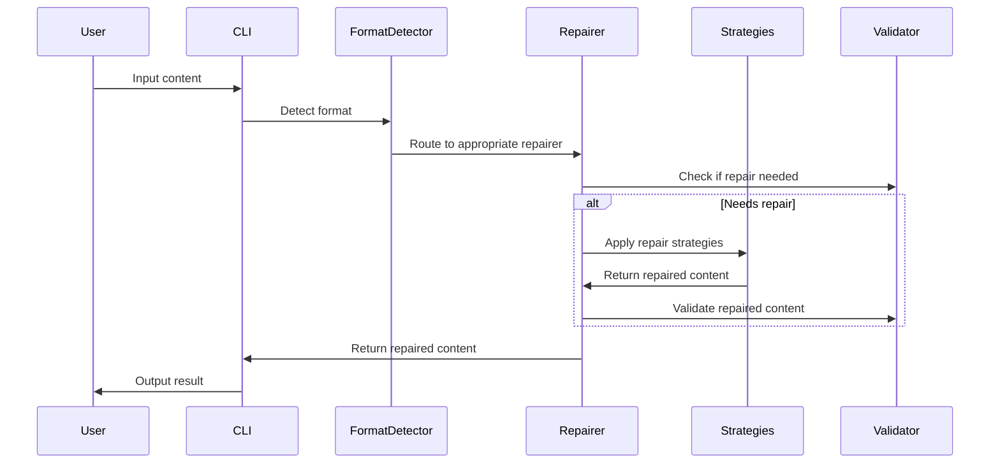

# Architecture

## Overview

AnyRepair is designed as a modular, extensible system for repairing LLM-generated content. The architecture follows Rust best practices with clear separation of concerns and trait-based design for testability.

## Core Components

### 1. Format Detection (`src/lib.rs`)

The main entry point provides automatic format detection and routing:

```rust
pub fn repair(content: &str) -> Result<String>
```

**Detection Logic:**
- JSON: Checks for `{}` or `[]` patterns
- YAML: Looks for `:`, `---`, or key-value patterns
- Markdown: Detects `#`, `**`, `*`, ````, or `[` patterns

### 2. Repair Traits (`src/traits.rs`)

Core traits define the repair interface:

```rust
pub trait Repair {
    fn repair(&self, content: &str) -> Result<String>;
    fn needs_repair(&self, content: &str) -> bool;
    fn confidence(&self, content: &str) -> f64;
}

pub trait RepairStrategy {
    fn apply(&self, content: &str) -> Result<String>;
    fn priority(&self) -> u8;
}

pub trait Validator {
    fn is_valid(&self, content: &str) -> bool;
    fn validate(&self, content: &str) -> Vec<String>;
}
```

### 3. Format-Specific Repairers

#### JSON Repairer (`src/json.rs`)

**Strategies:**
1. `AddMissingQuotesStrategy` - Adds quotes around unquoted keys
2. `FixTrailingCommasStrategy` - Removes trailing commas
3. `FixUnescapedQuotesStrategy` - Escapes quotes in strings
4. `AddMissingBracesStrategy` - Adds missing opening/closing braces
5. `FixSingleQuotesStrategy` - Converts single quotes to double quotes

**Validation:**
- Uses `serde_json::from_str::<Value>()` for validation
- Provides detailed error messages

#### YAML Repairer (`src/yaml.rs`)

**Strategies:**
1. `FixIndentationStrategy` - Fixes indentation based on context
2. `AddMissingColonsStrategy` - Adds missing colons after keys
3. `FixListFormattingStrategy` - Fixes list item formatting
4. `AddDocumentSeparatorStrategy` - Adds YAML document separator
5. `FixQuotedStringsStrategy` - Converts single quotes to double quotes

**Validation:**
- Uses `serde_yaml::from_str::<Value>()` for validation
- Checks for YAML-specific patterns

#### Markdown Repairer (`src/markdown.rs`)

**Strategies:**
1. `FixHeaderSpacingStrategy` - Adds spaces after `#` symbols
2. `FixCodeBlockFencesStrategy` - Ensures proper code block formatting
3. `FixListFormattingStrategy` - Fixes list item formatting
4. `FixLinkFormattingStrategy` - Validates and fixes link syntax
5. `FixBoldItalicStrategy` - Fixes bold/italic marker matching
6. `AddMissingNewlinesStrategy` - Adds proper spacing between elements

**Validation:**
- Checks for Markdown-specific features
- Validates code block fences, bold/italic markers, and links

### 4. Error Handling (`src/error.rs`)

Comprehensive error types with proper error chaining:

```rust
pub enum RepairError {
    JsonRepair(String),
    YamlRepair(String),
    MarkdownRepair(String),
    FormatDetection(String),
    Io(std::io::Error),
    Serde(serde_json::Error),
    Yaml(serde_yaml::Error),
    Regex(regex::Error),
    Generic(String),
}
```

### 5. CLI Interface (`src/main.rs`)

Command-line interface using `clap` with subcommands:

- `repair` - Auto-detect and repair content
- `json` - Repair JSON specifically
- `yaml` - Repair YAML specifically
- `markdown` - Repair Markdown specifically
- `validate` - Validate content without repair

## Design Patterns

### 1. Strategy Pattern

Each repair strategy is implemented as a separate struct implementing `RepairStrategy`. This allows for:
- Easy addition of new strategies
- Independent testing of strategies
- Priority-based application order

### 2. Trait-Based Design

All repairers implement the same `Repair` trait, enabling:
- Polymorphic usage
- Easy mocking for tests
- Consistent interface across formats

### 3. Error Propagation

Uses `thiserror` for automatic error trait implementations and proper error chaining.

### 4. Snapshot Testing

Uses `insta` for snapshot testing to ensure:
- Output consistency
- Regression prevention
- Easy test maintenance

## Data Flow



## Testing Strategy

### 1. Unit Tests

Each module has comprehensive unit tests covering:
- Happy path scenarios
- Error conditions
- Edge cases
- Strategy-specific behavior

### 2. Snapshot Tests

Uses `insta` for snapshot testing to ensure:
- Output format consistency
- Regression detection
- Easy test maintenance

### 3. Integration Tests

CLI integration tests verify:
- End-to-end functionality
- Error handling
- Output formatting

## Performance Considerations

### 1. Strategy Ordering

Strategies are applied in priority order (highest first) to ensure:
- Most important fixes are applied first
- Efficient repair process
- Minimal redundant operations

### 2. Validation Optimization

Validation is performed:
- Before repair (to skip unnecessary work)
- After repair (to ensure quality)
- Only when needed (lazy evaluation)

### 3. Memory Management

- Uses `String` for content (owned data)
- Avoids unnecessary allocations
- Efficient string operations

## Testing Architecture

### Test Coverage

The project includes comprehensive test coverage with **60+ test cases**:

#### JSON Tests (28 test cases)
- **Basic repair tests**: Core functionality validation
- **Edge case tests**: Empty strings, whitespace, partial JSON
- **Complex nested structures**: Deep objects and arrays
- **String handling**: Unicode, escape sequences, mixed quotes
- **Numeric edge cases**: Scientific notation, special values
- **Whitespace and formatting**: Various spacing scenarios
- **Malformed structures**: Missing colons, duplicate keys
- **Comments and metadata**: Comment removal, version info
- **API response scenarios**: Real-world API patterns
- **Configuration files**: Database, service configs
- **Extreme damage scenarios**: Multiple error types
- **Partial and truncated**: Incomplete data recovery
- **Nested arrays and objects**: Complex hierarchies

#### YAML Tests (12 test cases)
- Basic repair functionality
- Indentation and formatting
- List and structure repair
- String handling and escaping
- Complex nested structures
- Malformed cases and edge cases
- Confidence scoring
- Individual strategy testing

#### Markdown Tests (12 test cases)
- Header formatting and spacing
- Code block fences and indentation
- List formatting and nesting
- Bold and italic formatting
- Complex structures
- Malformed cases
- Confidence scoring
- Individual strategy testing

#### Integration Tests (4 test cases)
- Library integration
- Performance testing
- Error handling
- Memory usage validation

### Snapshot Testing

Uses `insta` for snapshot testing:
- Captures expected outputs
- Prevents regressions
- Easy to update when behavior changes
- Comprehensive coverage of repair scenarios

### Test Organization

```
tests/
├── integration_tests.rs    # Integration tests
└── snapshots/              # Snapshot files
    ├── json_repair_*.snap
    ├── yaml_repair_*.snap
    └── markdown_repair_*.snap
```

## Extensibility

### Adding New Formats

1. Create new module (e.g., `src/xml.rs`)
2. Implement `Repair`, `RepairStrategy`, and `Validator` traits
3. Add format detection logic
4. Update main repair function
5. Add CLI subcommand
6. Add comprehensive test cases

### Adding New Strategies

1. Create new struct implementing `RepairStrategy`
2. Add to repairer's strategy list
3. Set appropriate priority
4. Add tests with snapshots

### Adding New Validators

1. Implement `Validator` trait
2. Add validation logic
3. Integrate with repairer
4. Add validation tests

## Dependencies

### Core Dependencies
- `serde` - Serialization framework
- `serde_json` - JSON support
- `serde_yaml` - YAML support
- `pulldown-cmark` - Markdown parsing
- `regex` - Pattern matching
- `thiserror` - Error handling
- `anyhow` - Error context

### CLI Dependencies
- `clap` - Command-line argument parsing
- `tokio` - Async runtime
- `futures` - Async utilities

### Development Dependencies
- `insta` - Snapshot testing
- `criterion` - Benchmarking
- `tempfile` - Temporary file handling

## Future Enhancements

1. **Additional Formats**: XML, TOML, CSV support
2. **Advanced Strategies**: Machine learning-based repair
3. **Performance**: Parallel strategy application
4. **Configuration**: User-configurable repair rules
5. **Plugins**: External strategy loading
6. **Metrics**: Repair success rate tracking
