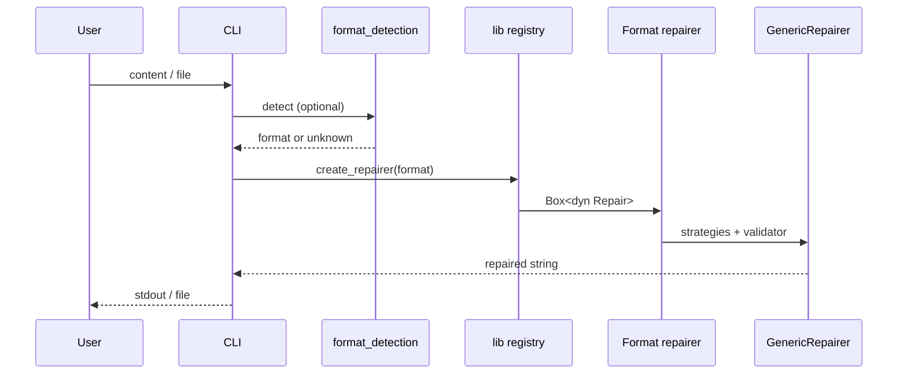

# Architecture

## Overview

AnyRepair is a Rust library and CLI for repairing malformed structured data. The design centers on a **format registry** in `lib.rs`, **trait-based repairers**, and a shared **strategy pipeline** (`GenericRepairer`). Repairs are deterministic heuristics—no ML and no network calls.

## Repository layout

```
anyrepair/
├── README.md, SPEC.md, TODO.md, ARCHITECTURE.md   # Root docs
├── Cargo.toml
├── src/
│   ├── lib.rs                 # Public API, format registry
│   ├── main.rs                # CLI (clap)
│   ├── bin/mcp_server.rs      # MCP binary entry
│   ├── format_detection.rs    # Auto-detect heuristics
│   ├── traits.rs              # Repair, RepairStrategy, Validator
│   ├── repairer_base.rs       # GenericRepairer
│   ├── error.rs
│   ├── json.rs, yaml.rs, markdown.rs, xml.rs, toml.rs, csv.rs, diff.rs
│   ├── key_value.rs           # INI, .properties, .env
│   ├── streaming.rs
│   ├── mcp_server.rs
│   └── cli/                   # repair, validate, batch, stream, completions
├── tests/                     # Integration, fuzz, streaming, CLI, diff
├── examples/                  # MCP and sample data
└── docs/                      # CHANGELOG, MCP guide, test summary, index
```

## Core components

### Format registry (`src/lib.rs`)

Single source of truth for supported formats, factories, and top-level helpers:

| Constant / function | Role |
|---------------------|------|
| `SUPPORTED_FORMATS` | Canonical format names (10 formats) |
| `normalize_format` | Aliases: `yml` → `yaml`, `md` → `markdown` |
| `create_repairer` / `create_validator` | `Box<dyn …>` factories |
| `detect_format` | Delegates to `format_detection` |
| `repair` / `repair_with_format` | High-level repair API |
| `jsonrepair` | Python-compatible JSON entry point |

**Formats:** `json`, `yaml`, `markdown`, `xml`, `toml`, `csv`, `ini`, `diff`, `properties`, `env`.

**Key-value formats** (`ini`, `properties`, `env`) live in `key_value.rs` and share strategies (equals signs, whitespace, sections, escaping) with format-specific validators.

Adding a format: extend `SUPPORTED_FORMATS`, add match arms in `create_repairer` / `create_validator`, implement repairer + validator, and optionally extend `format_detection.rs`. The CLI `repair --format` picks up new formats without new subcommands.

### Format detection (`src/format_detection.rs`)

Heuristic order (trimmed input):

1. JSON — `{` / `[` patterns  
2. Diff — before YAML/CSV (avoids false positives on `:` and `,`)  
3. YAML  
4. XML  
5. TOML  
6. CSV  
7. INI — `[section]`, `key=value` without YAML/TOML signals  
8. Markdown — `#`, fences, emphasis  

`properties` and `env` are **not** auto-detected; use `repair_with_format` or `repair --format properties|env`.

Unknown auto-detect in `repair()` falls back to the Markdown repairer.

### Traits (`src/traits.rs`)

```rust
pub trait Repair {
    fn repair(&mut self, content: &str) -> Result<String>;
    fn needs_repair(&self, content: &str) -> bool;
    fn confidence(&self, content: &str) -> f64;
}

pub trait RepairStrategy {
    fn apply(&self, content: &str) -> Result<String>;
    fn priority(&self) -> u8;
    fn name(&self) -> &str;
}

pub trait Validator {
    fn is_valid(&self, content: &str) -> bool;
    fn validate(&self, content: &str) -> Vec<String>;
}
```

### Generic repair pipeline (`src/repairer_base.rs`)

Each format repairer typically wraps `GenericRepairer`:

1. Trim input; return empty for empty input.  
2. If validator says valid, return unchanged.  
3. Apply strategies in **descending priority** order.  
4. Format-specific types may override `confidence()`.

### CLI (`src/main.rs`, `src/cli/`)

| Command | Purpose |
|---------|---------|
| `repair` | Auto-detect or `--format`; optional `--confidence`, `--diff`, `--dry-run`, `--json`, `--min-confidence`, `--explain`, `--color` |
| `validate` | Validate without repair |
| `batch` | Directory copy/repair with pattern and `--recursive` |
| `stream` | Line-oriented large-file repair |
| `completions` | Generate shell completions (bash/zsh/fish/elvish/powershell) |

Global flags: `--verbose`, `--quiet`.

### Streaming (`src/streaming.rs`)

`StreamingRepair` reads/writes line-by-line with configurable buffer size. Used by CLI `stream` and the `StreamingRepair` public type.

### MCP server (`src/mcp_server.rs`, `src/bin/mcp_server.rs`)

`AnyrepairMcpServer` registers tools from `SUPPORTED_FORMATS`:

- `repair` — auto-detect  
- `repair_<format>` — one per format (10)  
- `validate` — requires `content` + `format`  

**12 tools** total. Binary speaks JSON lines on stdin/stdout (see [docs/MCP_SERVER.md](docs/MCP_SERVER.md)).

## Data flow


```mermaid
sequenceDiagram
    participant User
    participant CLI
    participant Detect as format_detection
    participant Factory as lib registry
    participant Repairer as Format repairer
    participant Pipe as GenericRepairer

    User->>CLI: content / file
    CLI->>Detect: detect (optional)
    Detect-->>CLI: format or unknown
    CLI->>Factory: create_repairer(format)
    Factory->>Repairer: Box<dyn Repair>
    Repairer->>Pipe: strategies + validator
    Pipe-->>CLI: repaired string
    CLI-->>User: stdout / file
```

## Testing

| Suite | Tests | File |
|-------|------:|------|
| Library + modules | 168 | `src/**/*.rs` |
| Binary (CLI handlers) | 19 | `src/main.rs` |
| CLI | 15 | `tests/cli_tests.rs` |
| Integration | 17 | `tests/integration_tests.rs` |
| Properties/env | 25 | `tests/properties_env_tests.rs` |
| Diff | 35 | `tests/diff_tests.rs` |
| Fuzz (proptest) | 34 | `tests/fuzz_tests.rs` |
| Streaming | 26 | `tests/streaming_tests.rs` |
| Damage scenarios | 18 | `tests/damage_scenarios.rs` |
| Complex damage | 18 | `tests/complex_damage_tests.rs` |
| Complex streaming | 18 | `tests/complex_streaming_tests.rs` |
| Golden master | 26 | `tests/golden_master_tests.rs` |
| **Total** | **415** | |

Run: `cargo test`. Benchmarks: `benches/repair_benchmarks.rs` (criterion).

## Dependencies (runtime)

| Crate | Use |
|-------|-----|
| `regex` | Repair patterns |
| `thiserror` | `RepairError` |
| `clap` | CLI |
| `clap_complete` | Shell completions |
| `serde_json` (optional) | Strict JSON validation (`strict` feature) |

Edition **2024**. Release profile favors small binaries (`opt-level = "z"`, LTO, strip).

## Extensibility

**New format:** new module → `Repair` + strategies + `Validator` → registry + optional detection heuristic → tests in `tests/` and module `#[cfg(test)]`.

**New strategy:** implement `RepairStrategy`, register in the format repairer’s strategy list with priority, add unit tests.

## Related docs

- [SPEC.md](SPEC.md) — requirements and API contract  
- [TODO.md](TODO.md) — backlog  
- [docs/CHANGELOG.md](docs/CHANGELOG.md) — version history  
- [docs/MCP_SERVER.md](docs/MCP_SERVER.md) — MCP setup  
