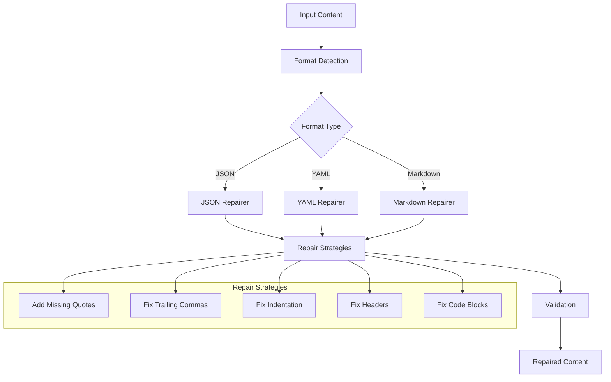

# AnyRepair

A Rust crate for repairing LLM responses including JSON, YAML, and Markdown.

## Features

- **JSON Repair**: Fixes common JSON issues including:
  - Missing quotes and unescaped quotes
  - Trailing commas and missing commas
  - Missing braces and brackets
  - Single quote to double quote conversion
  - Unicode and special character handling
  - Complex nested structures
  - API response patterns and configuration files
- **YAML Repair**: Repairs YAML formatting issues including:
  - Indentation problems
  - Missing colons and list formatting
  - Document separators
  - Complex nested structures
- **Markdown Repair**: Fixes Markdown syntax issues including:
  - Header spacing and formatting
  - Code block fences and indentation
  - List formatting and nesting
  - Link and image syntax
  - Bold and italic formatting
- **Auto-detection**: Automatically detects the format and applies appropriate repairs
- **Confidence scoring**: Provides confidence scores for repair quality assessment
- **CLI interface**: Command-line tool for easy usage
- **Comprehensive testing**: 60+ test cases with snapshot testing covering real-world scenarios

## Installation

Add this to your `Cargo.toml`:

```toml
[dependencies]
anyrepair = "0.1.0"
```

## Usage

### Library Usage

```rust
use anyrepair::{repair, json, yaml, markdown};

// Auto-detect format and repair
let content = r#"{"name": "John", "age": 30,}"#;
let repaired = repair(content)?;
println!("{}", repaired); // {"name": "John", "age": 30}

// Specific format repair
let json_repairer = json::JsonRepairer::new();
let repaired_json = json_repairer.repair(content)?;

// Check if repair is needed
if json_repairer.needs_repair(content) {
    println!("Content needs repair");
}

// Get confidence score
let confidence = json_repairer.confidence(content);
println!("Confidence: {:.2}", confidence);
```

### Advanced Examples

#### Complex JSON Repair
```rust
use anyrepair::json::JsonRepairer;

let damaged_json = r#"{
    'name': "John",
    "age": 30,
    "hobbies": ["reading", "coding", "gaming",],
    "address": {
        "street": "123 Main St",
        "city": "New York"
    },
    "isActive": true,
    "score": 95.5,
}"#;

let repairer = JsonRepairer::new();
let repaired = repairer.repair(damaged_json)?;
// Result: Valid JSON with all issues fixed
```

#### YAML Repair
```rust
use anyrepair::yaml::YamlRepairer;

let damaged_yaml = r#"name: John
age: 30
hobbies:
- reading
- coding
- gaming
address:
  street: 123 Main St
  city: New York"#;

let repairer = YamlRepairer::new();
let repaired = repairer.repair(damaged_yaml)?;
```

#### Markdown Repair
```rust
use anyrepair::markdown::MarkdownRepairer;

let damaged_markdown = r#"#Header
Some **bold** text
- item1
- item2
1.item3"#;

let repairer = MarkdownRepairer::new();
let repaired = repairer.repair(damaged_markdown)?;
// Result: Properly formatted Markdown
```

### CLI Usage

```bash
# Auto-detect and repair
echo '{"name": "John", "age": 30,}' | anyrepair repair

# Repair specific format
echo 'name: John\nage: 30' | anyrepair yaml
echo '#Header\nSome **bold** text' | anyrepair markdown

# Validate content
echo '{"name": "John"}' | anyrepair validate

# Show confidence score
echo '{"name": "John", "age": 30,}' | anyrepair repair --confidence
```

## Architecture



## API Reference

### Core Traits

- `Repair`: Main trait for content repair functionality
- `RepairStrategy`: Trait for specific repair strategies
- `Validator`: Trait for content validation

### Repairers

- `JsonRepairer`: Repairs JSON content
- `YamlRepairer`: Repairs YAML content
- `MarkdownRepairer`: Repairs Markdown content

### Error Handling

The crate uses a custom `RepairError` enum for error handling:

```rust
pub enum RepairError {
    JsonRepair(String),
    YamlRepair(String),
    MarkdownRepair(String),
    FormatDetection(String),
    Io(std::io::Error),
    Serde(serde_json::Error),
    Yaml(serde_yaml::Error),
    Regex(regex::Error),
    Generic(String),
}
```

## Testing

The crate includes comprehensive tests with snapshot testing using `insta`:

```bash
# Run all tests
cargo test

# Run tests with snapshot updates
cargo insta test
cargo insta review
```

## Contributing

1. Fork the repository
2. Create a feature branch
3. Make your changes
4. Add tests for new functionality
5. Run `cargo test` to ensure all tests pass
6. Submit a pull request

## License

This project is licensed under the MIT License - see the LICENSE file for details.

## Changelog

### 0.1.0
- Initial release
- JSON repair functionality with 5 core strategies
- YAML repair functionality with 4 core strategies  
- Markdown repair functionality with 4 core strategies
- CLI interface with clap
- Comprehensive test coverage (60+ test cases)
- Auto-format detection
- Confidence scoring system
- Snapshot testing with insta
- Support for complex nested structures
- Unicode and special character handling
- Real-world damage scenario testing
- API response pattern repair
- Configuration file repair
- Performance benchmarking
