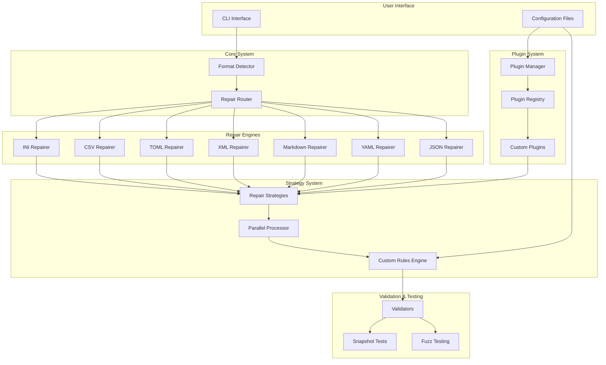
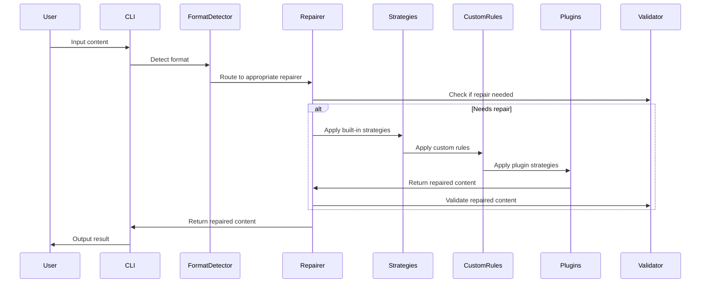

# Architecture

## Overview

AnyRepair is designed as a modular, extensible system for repairing LLM-generated content. The architecture follows Rust best practices with clear separation of concerns and trait-based design for testability. 

## Module Organization

The codebase is organized into logical modules for better maintainability:

```
src/
├── lib.rs                 # Main library entry point
├── main.rs               # CLI application (180 lines, optimized)
├── bin/
│   └── mcp_server.rs     # MCP server binary
├── cli/                  # CLI module (modulized)
│   ├── mod.rs           # CLI utilities and exports
│   ├── repair_cmd.rs    # Repair command handlers
│   ├── validate_cmd.rs  # Validation command
│   ├── batch_cmd.rs     # Batch processing command
│   ├── rules_cmd.rs     # Rules management command
│   └── stream_cmd.rs    # Streaming command
├── json/                 # JSON module (modulized, 573 lines total)
│   ├── mod.rs           # Main repairer (216 lines)
│   ├── strategies.rs    # Repair strategies (312 lines)
│   └── validator.rs     # JSON validator (45 lines)
├── markdown/             # Markdown module (modulized, 554 lines total)
│   ├── mod.rs           # Main repairer (186 lines)
│   ├── strategies.rs    # Repair strategies (301 lines)
│   └── validator.rs     # Markdown validator (67 lines)
├── mcp_server.rs        # MCP server implementation (312 lines)
├── streaming.rs         # Streaming repair support
├── error.rs             # Error types
├── traits.rs            # Core trait definitions
├── repairer_base.rs     # Base repairer implementation
├── yaml.rs              # YAML repairer
├── xml.rs               # XML repairer
├── csv.rs               # CSV repairer
├── toml.rs              # TOML repairer
├── ini.rs               # INI repairer
├── plugin.rs            # Plugin system
├── plugin_config.rs     # Plugin configuration
├── plugin_integration.rs # Plugin integration
├── config.rs            # Configuration management
├── custom_rules.rs      # Custom repair rules
├── parallel.rs          # Parallel processing
├── parallel_strategy.rs # Strategy application
├── advanced.rs          # Advanced features
├── context_parser.rs    # Context parsing
├── enhanced_json.rs     # Enhanced JSON repair
├── analytics.rs         # Analytics and metrics tracking
├── batch_processor.rs   # Batch file processing
├── validation_rules.rs  # Custom validation rules
└── audit_log.rs         # Audit logging and compliance
```

### Module Hierarchy

- **Root Level Modules**: Format-specific repairers kept at root for backward compatibility
- **`repairers/`**: Organized access to all format-specific repair implementations
- **`utils/`**: Advanced utilities and helper functions
- **Plugin System**: Extensible plugin architecture
- **Configuration**: User-defined repair rules and settings

## Core Components

### 1. Format Detection (`src/lib.rs`)

The main entry point provides automatic format detection and routing:

```rust
pub fn repair(content: &str) -> Result<String>
```

**Detection Logic:**
- JSON: Checks for `{}` or `[]` patterns
- YAML: Looks for `:`, `---`, or key-value patterns
- Markdown: Detects `#`, `**`, `*`, ````, or `[` patterns

### 2. Repair Traits (`src/traits.rs`)

Core traits define the repair interface:

```rust
pub trait Repair {
    fn repair(&self, content: &str) -> Result<String>;
    fn needs_repair(&self, content: &str) -> bool;
    fn confidence(&self, content: &str) -> f64;
}

pub trait RepairStrategy {
    fn apply(&self, content: &str) -> Result<String>;
    fn priority(&self) -> u8;
}

pub trait Validator {
    fn is_valid(&self, content: &str) -> bool;
    fn validate(&self, content: &str) -> Vec<String>;
}
```

### 3. Format-Specific Repairers

#### JSON Repairer (`src/json.rs`)

**Strategies:**
1. `AddMissingQuotesStrategy` - Adds quotes around unquoted keys
2. `FixTrailingCommasStrategy` - Removes trailing commas
3. `FixUnescapedQuotesStrategy` - Escapes quotes in strings
4. `AddMissingBracesStrategy` - Adds missing opening/closing braces
5. `FixSingleQuotesStrategy` - Converts single quotes to double quotes

**Validation:**
- Uses `serde_json::from_str::<Value>()` for validation
- Provides detailed error messages

#### YAML Repairer (`src/yaml.rs`)

**Strategies:**
1. `FixIndentationStrategy` - Fixes indentation based on context
2. `AddMissingColonsStrategy` - Adds missing colons after keys
3. `FixListFormattingStrategy` - Fixes list item formatting
4. `AddDocumentSeparatorStrategy` - Adds YAML document separator
5. `FixQuotedStringsStrategy` - Converts single quotes to double quotes

**Validation:**
- Uses `serde_yaml::from_str::<Value>()` for validation
- Checks for YAML-specific patterns

#### Markdown Repairer (`src/markdown.rs`)

**Strategies:**
1. `FixHeaderSpacingStrategy` - Adds spaces after `#` symbols
2. `FixCodeBlockFencesStrategy` - Ensures proper code block formatting
3. `FixListFormattingStrategy` - Fixes list item formatting
4. `FixLinkFormattingStrategy` - Validates and fixes link syntax
5. `FixBoldItalicStrategy` - Fixes bold/italic marker matching
6. `AddMissingNewlinesStrategy` - Adds proper spacing between elements

**Validation:**
- Checks for Markdown-specific features
- Validates code block fences, bold/italic markers, and links

### 4. Error Handling (`src/error.rs`)

Comprehensive error types with proper error chaining:

```rust
pub enum RepairError {
    JsonRepair(String),
    YamlRepair(String),
    MarkdownRepair(String),
    FormatDetection(String),
    Io(std::io::Error),
    Serde(serde_json::Error),
    Yaml(serde_yaml::Error),
    Regex(regex::Error),
    Generic(String),
}
```

### 5. CLI Interface (`src/main.rs`)

Command-line interface using `clap` with subcommands:

- `repair` - Auto-detect and repair content
- `json` - Repair JSON specifically
- `yaml` - Repair YAML specifically
- `markdown` - Repair Markdown specifically
- `xml` - Repair XML specifically
- `toml` - Repair TOML specifically
- `csv` - Repair CSV specifically
- `ini` - Repair INI specifically
- `validate` - Validate content without repair
- `batch` - Batch process multiple files
- `stats` - Show repair statistics
- `rules` - Manage custom repair rules
- `plugins` - Manage plugins

### 6. Plugin System (`src/plugin.rs`, `src/plugin_config.rs`, `src/plugin_integration.rs`)

Extensible plugin architecture:

- **Plugin Trait**: Core interface for custom repair strategies
- **Plugin Registry**: Manages loaded plugins
- **Plugin Manager**: Handles plugin lifecycle and statistics
- **Plugin Configuration**: TOML-based plugin settings
- **Plugin Integration**: Seamless integration with repair system

### 7. Custom Rules System (`src/config.rs`, `src/custom_rules.rs`)

User-defined repair rules:

- **RepairConfig**: Global and format-specific settings
- **CustomRule**: Regex-based repair patterns
- **CustomRuleEngine**: Applies custom rules with conditions
- **Rule Templates**: Pre-built rule templates
- **CLI Management**: Full command-line rule management

### 8. Advanced Features

- **Parallel Processing**: Multi-threaded strategy application
- **Fuzz Testing**: Property-based testing for robustness
- **Configuration Management**: TOML-based configuration
- **Performance Optimization**: Regex caching and memory management

## Design Patterns

### 1. Strategy Pattern

Each repair strategy is implemented as a separate struct implementing `RepairStrategy`. This allows for:
- Easy addition of new strategies
- Independent testing of strategies
- Priority-based application order

### 2. Trait-Based Design

All repairers implement the same `Repair` trait, enabling:
- Polymorphic usage
- Easy mocking for tests
- Consistent interface across formats

### 3. Error Propagation

Uses `thiserror` for automatic error trait implementations and proper error chaining.

### 4. Snapshot Testing

Uses `insta` for snapshot testing to ensure:
- Output consistency
- Regression prevention
- Easy test maintenance

## System Architecture



## Data Flow



## Testing Strategy

### 1. Unit Tests

Each module has comprehensive unit tests covering:
- Happy path scenarios
- Error conditions
- Edge cases
- Strategy-specific behavior

### 2. Snapshot Tests

Uses `insta` for snapshot testing to ensure:
- Output format consistency
- Regression detection
- Easy test maintenance

### 3. Integration Tests

CLI integration tests verify:
- End-to-end functionality
- Error handling
- Output formatting

## Performance Considerations

### 1. Strategy Ordering

Strategies are applied in priority order (highest first) to ensure:
- Most important fixes are applied first
- Efficient repair process
- Minimal redundant operations

### 2. Validation Optimization

Validation is performed:
- Before repair (to skip unnecessary work)
- After repair (to ensure quality)
- Only when needed (lazy evaluation)

### 3. Memory Management

- Uses `String` for content (owned data)
- Avoids unnecessary allocations
- Efficient string operations

## Testing Architecture

### Test Coverage

The project includes comprehensive test coverage with **116+ test cases**:

#### JSON Tests (28 test cases)
- **Basic repair tests**: Core functionality validation
- **Edge case tests**: Empty strings, whitespace, partial JSON
- **Complex nested structures**: Deep objects and arrays
- **String handling**: Unicode, escape sequences, mixed quotes
- **Numeric edge cases**: Scientific notation, special values
- **Whitespace and formatting**: Various spacing scenarios
- **Malformed structures**: Missing colons, duplicate keys
- **Comments and metadata**: Comment removal, version info
- **API response scenarios**: Real-world API patterns
- **Configuration files**: Database, service configs
- **Extreme damage scenarios**: Multiple error types
- **Partial and truncated**: Incomplete data recovery
- **Nested arrays and objects**: Complex hierarchies

#### YAML Tests (12 test cases)
- Basic repair functionality
- Indentation and formatting
- List and structure repair
- String handling and escaping
- Complex nested structures
- Malformed cases and edge cases
- Confidence scoring
- Individual strategy testing

#### Markdown Tests (12 test cases)
- Header formatting and spacing
- Code block fences and indentation
- List formatting and nesting
- Bold and italic formatting
- Complex structures
- Malformed cases
- Confidence scoring
- Individual strategy testing

#### Additional Format Tests (40+ test cases)
- **XML Tests**: Basic repair, invalid characters, unclosed tags, malformed attributes
- **TOML Tests**: Basic repair, malformed arrays, missing quotes, malformed numbers
- **CSV Tests**: Basic repair, unquoted strings, malformed quotes, extra commas
- **INI Tests**: Basic repair, missing equals, malformed sections, unquoted values

#### Advanced Tests (20+ test cases)
- **Fuzz Tests**: Property-based testing for all formats
- **Plugin Tests**: Plugin system functionality
- **Custom Rules Tests**: Rule engine and configuration
- **Parallel Processing Tests**: Multi-threaded strategy application
- **Configuration Tests**: TOML configuration management

#### Integration Tests (4 test cases)
- Library integration
- Performance testing
- Error handling
- Memory usage validation

### Snapshot Testing

Uses `insta` for snapshot testing:
- Captures expected outputs
- Prevents regressions
- Easy to update when behavior changes
- Comprehensive coverage of repair scenarios

### Test Organization

```
tests/
├── integration_tests.rs    # Integration tests
├── damage_scenarios.rs     # Comprehensive damage scenario tests
├── fuzz_tests.rs          # Property-based fuzz testing
└── snapshots/              # Snapshot files
    ├── json_repair_*.snap
    ├── yaml_repair_*.snap
    ├── markdown_repair_*.snap
    ├── xml_repair_*.snap
    ├── toml_repair_*.snap
    ├── csv_repair_*.snap
    └── ini_repair_*.snap
```

## Extensibility

### Adding New Formats

1. Create new module (e.g., `src/xml.rs`)
2. Implement `Repair`, `RepairStrategy`, and `Validator` traits
3. Add format detection logic
4. Update main repair function
5. Add CLI subcommand
6. Add comprehensive test cases

### Adding New Strategies

1. Create new struct implementing `RepairStrategy`
2. Add to repairer's strategy list
3. Set appropriate priority
4. Add tests with snapshots

### Adding New Validators

1. Implement `Validator` trait
2. Add validation logic
3. Integrate with repairer
4. Add validation tests

## Dependencies

### Core Dependencies
- `serde` - Serialization framework
- `serde_json` - JSON support
- `serde_yaml` - YAML support
- `pulldown-cmark` - Markdown parsing
- `regex` - Pattern matching
- `thiserror` - Error handling
- `anyhow` - Error context

### CLI Dependencies
- `clap` - Command-line argument parsing
- `tokio` - Async runtime
- `futures` - Async utilities

### Development Dependencies
- `insta` - Snapshot testing
- `criterion` - Benchmarking
- `tempfile` - Temporary file handling
- `proptest` - Property-based testing
- `arbitrary` - Fuzz testing support

## MCP Server Integration

### MCP Server (`src/mcp_server.rs`)

The MCP (Model Context Protocol) server provides integration with Claude and other AI clients:

**Architecture:**
- `AnyrepairMcpServer` - Main server implementation
- 9 available tools (repair, repair_json, repair_yaml, repair_markdown, repair_xml, repair_toml, repair_csv, repair_ini, validate)
- JSON-based request/response protocol
- Stateless design for scalability

**Features:**
- Auto-detect and repair functionality
- Format-specific repair with confidence scoring
- Content validation across all formats
- Error handling with descriptive messages
- Tool discovery and metadata

**Binary:** `src/bin/mcp_server.rs` (39 lines)
- Stdin/stdout interface
- Server info and tool discovery
- Request processing loop
- Graceful EOF handling

**Integration:**
- Claude desktop integration via `claude_desktop_config.json`
- Supports all 7 repair formats
- Confidence scoring for format-specific repairs
- Comprehensive error handling

## Modulization Strategy

### Phase 1: JSON Module (Complete)
- Extracted strategies to `src/json/strategies.rs`
- Extracted validator to `src/json/validator.rs`
- Created `src/json/mod.rs` for main repairer
- Reduced from 2082 to 573 lines (73% reduction)

### Phase 2: Markdown Module (Complete)
- Extracted strategies to `src/markdown/strategies.rs`
- Extracted validator to `src/markdown/validator.rs`
- Created `src/markdown/mod.rs` for main repairer
- Reduced from 938 to 554 lines (41% reduction)

### Phase 3: CLI Module (Complete)
- Extracted command handlers to `src/cli/`
- Created separate files for each command type
- Reduced main.rs from 881 to 180 lines (80% reduction)
- Maintained backward compatibility

**Total Modulization Impact:**
- Before: 3901 lines in large files
- After: 1662 lines in organized modules
- Overall reduction: 57%

## Enterprise Features

### Analytics Module (`analytics.rs`)
Tracks repair operations and provides detailed metrics:
- Repair success metrics (total, successful, failed repairs)
- Performance monitoring (average repair time, total time)
- Format-specific metrics (per-format statistics)
- Success rate calculation

### Batch Processor (`batch_processor.rs`)
Processes multiple files with automatic format detection:
- Directory processing (recursive or single-level)
- Multi-format support (automatic detection)
- File filtering by extension
- Detailed per-file results
- Integrated analytics tracking

### Validation Rules (`validation_rules.rs`)
Custom validation rules engine:
- Multiple rule types (Regex, Length, Format, Custom)
- Rule management (add, remove, enable/disable)
- Flexible validation against multiple rules
- Detailed violation reporting

### Audit Logging (`audit_log.rs`)
Comprehensive audit logging for compliance:
- Event tracking (repairs, validations, batch operations, config changes)
- Detailed entries (timestamp, actor, resource, action, result)
- File persistence for compliance
- Query capabilities (filter by type or actor)
- JSON format for easy parsing

## Future Enhancements

1. **Additional Formats**: ✅ XML, TOML, CSV, INI support completed
2. **Advanced Strategies**: ✅ Parallel strategy application completed
3. **Configuration**: ✅ User-configurable repair rules completed
4. **Plugins**: ✅ External strategy loading completed
5. **Fuzz Testing**: ✅ Comprehensive property-based testing completed
6. **Advanced Analytics**: ✅ Repair success rate tracking and performance monitoring completed
7. **Enterprise Features**: ✅ Batch processing, validation rules, audit logging completed
8. **Web Interface**: Create a simple web interface for online repair
9. **REST API**: Add REST API for programmatic access
10. **Docker Container**: Create Docker image for easy deployment
11. **Machine Learning**: ML-based repair strategies for complex cases
