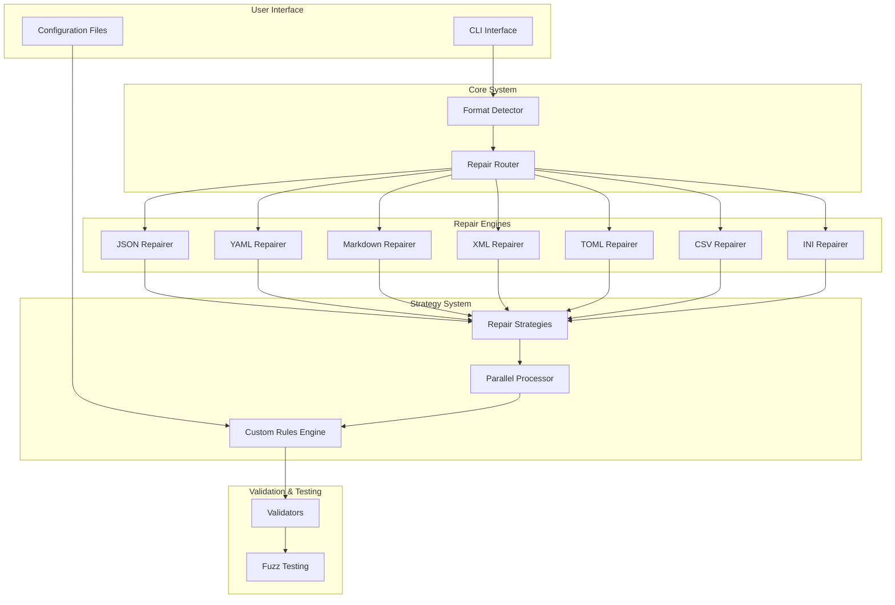
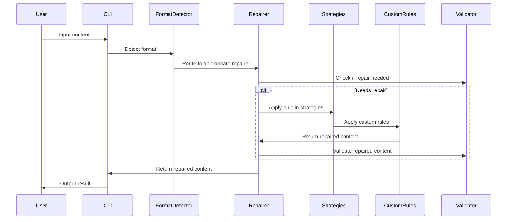

# Architecture

## Overview

AnyRepair is designed as a modular, extensible system for repairing LLM-generated content. The architecture follows Rust best practices with clear separation of concerns and trait-based design for testability. 

## Project Structure

### Directory Organization

```
anyrepair/
├── README.md              # Main project documentation
├── TODO.md                # Task tracking and roadmap
├── Cargo.toml             # Project manifest
├── src/                   # Source code
│   ├── lib.rs            # Library entry point
│   ├── main.rs           # CLI application
│   ├── bin/              # Binary executables
│   │   └── mcp_server.rs # MCP server binary
│   ├── cli/              # CLI module
│   │   ├── mod.rs
│   │   ├── repair_cmd.rs
│   │   ├── validate_cmd.rs
│   │   ├── batch_cmd.rs
│   │   ├── rules_cmd.rs
│   │   └── stream_cmd.rs
│   ├── json.rs           # JSON repairer
│   ├── yaml.rs           # YAML repairer
│   ├── markdown.rs       # Markdown repairer
│   ├── xml.rs            # XML repairer
│   ├── toml.rs           # TOML repairer
│   ├── csv.rs            # CSV repairer
│   ├── ini.rs            # INI repairer
│   ├── diff.rs           # Diff/Unified diff repairer
│   ├── mcp_server.rs     # MCP server implementation
│   ├── streaming.rs      # Streaming repair support
│   ├── format_detection.rs # Format detection heuristics
│   ├── error.rs          # Error types
│   ├── traits.rs         # Core trait definitions
│   ├── repairer_base.rs  # Base repairer implementation
│   └── ...               # Other utility modules
├── examples/             # Usage examples
│   ├── README.md
│   └── data/             # Test data files
├── tests/                # Test suites
├── docs/                 # Documentation
│   ├── INDEX.md         # Documentation index
│   ├── ARCHITECTURE.md  # This file
│   ├── CHANGELOG.md     # Version history
│   └── ...              # Other docs
└── target/              # Build output
```

### Module Organization

The codebase is organized into logical modules for better maintainability:

```
src/
├── lib.rs                 # Main library entry point
├── main.rs               # CLI application (180 lines, optimized)
├── bin/
│   └── mcp_server.rs     # MCP server binary
├── cli/                  # CLI module (modulized)
│   ├── mod.rs           # CLI utilities and exports
│   ├── repair_cmd.rs    # Repair command handlers
│   ├── validate_cmd.rs  # Validation command
│   ├── batch_cmd.rs     # Batch processing command
│   ├── rules_cmd.rs     # Rules management command
│   └── stream_cmd.rs    # Streaming command
├── json.rs               # JSON repairer (consolidated, 571 lines)
├── markdown.rs           # Markdown repairer (consolidated, ~550 lines)
├── diff.rs               # Diff/Unified diff repairer
├── mcp_server.rs        # MCP server implementation (312 lines)
├── streaming.rs         # Streaming repair support
├── format_detection.rs  # Format detection heuristics (SoC)
├── error.rs             # Error types
├── traits.rs            # Core trait definitions
├── repairer_base.rs     # Base repairer implementation
├── yaml.rs              # YAML repairer
├── xml.rs               # XML repairer
├── csv.rs               # CSV repairer
├── toml.rs              # TOML repairer
├── ini.rs               # INI repairer
├── config.rs            # Configuration management
├── custom_rules.rs      # Custom repair rules
├── advanced.rs          # Advanced features
├── context_parser.rs    # Context parsing
└── enhanced_json.rs     # Enhanced JSON repair
```

### Module Hierarchy

- **Format-Specific Repairers**: Direct modules at root level (`json`, `yaml`, `markdown`, `xml`, `toml`, `csv`, `ini`, `diff`)
- **Utility Modules**: Helper functions at root level (`advanced`, `parallel`, `context_parser`, `enhanced_json`)
- **Configuration**: User-defined repair rules and settings

## Core Components

### 1. Format Registry & Detection (`src/lib.rs`, `src/format_detection.rs`)

The library provides a centralized format registry — the **single source of truth** for all format→repairer/validator mapping:

```rust
// Format registry (lib.rs)
pub const SUPPORTED_FORMATS: &[&str];           // All canonical format names
pub fn normalize_format(format: &str) -> &str;  // Resolve aliases (yml→yaml, md→markdown)
pub fn create_repairer(format: &str) -> Result<Box<dyn Repair>>;    // Factory
pub fn create_validator(format: &str) -> Result<Box<dyn Validator>>; // Factory
pub fn detect_format(content: &str) -> Option<&'static str>;        // Auto-detect
pub fn repair(content: &str) -> Result<String>;                     // Auto-detect + repair
pub fn repair_with_format(content: &str, format: &str) -> Result<String>; // Explicit format
pub fn jsonrepair(json_str: &str) -> Result<String>;  // Python-compatible API
```

**Format Detection** (`format_detection.rs`) is separated into its own module (SoC):
- JSON: Checks for `{}` or `[]` patterns
- Diff: Checks for `@@` hunk headers and paired `---`/`+++` file headers
- YAML: Looks for `:`, `---`, or key-value patterns
- XML, TOML, CSV, INI, Markdown: Format-specific heuristics

**Python-Compatible API:**
- `jsonrepair()` - Function-based API matching Python's jsonrepair
- `JsonRepair` - Struct-based API matching Python's JsonRepair class

### 2. Repair Traits (`src/traits.rs`)

Core traits define the repair interface:

```rust
pub trait Repair {
    fn repair(&self, content: &str) -> Result<String>;
    fn needs_repair(&self, content: &str) -> bool;
    fn confidence(&self, content: &str) -> f64;
}

pub trait RepairStrategy {
    fn apply(&self, content: &str) -> Result<String>;
    fn priority(&self) -> u8;
}

pub trait Validator {
    fn is_valid(&self, content: &str) -> bool;
    fn validate(&self, content: &str) -> Vec<String>;
}
```

### 3. Format-Specific Repairers

#### JSON Repairer (`src/json.rs`)

**Strategies:**
1. `StripTrailingContentStrategy` - Removes content after JSON closes
2. `AddMissingQuotesStrategy` - Adds quotes around unquoted keys
3. `FixTrailingCommasStrategy` - Removes trailing commas
4. `AddMissingBracesStrategy` - Adds missing opening/closing braces
5. `FixSingleQuotesStrategy` - Converts single quotes to double quotes
6. `FixMalformedNumbersStrategy` - Fixes malformed numeric values
7. `FixBooleanNullStrategy` - Converts Python-style booleans/null to JSON
8. `FixAgenticAiResponseStrategy` - Special handling for AI responses

**Python-Compatible API:**
- `jsonrepair(json_str: &str) -> Result<String>` - Function-based API matching Python's jsonrepair
- `JsonRepair` struct with `jsonrepair()` method - Class-based API matching Python's JsonRepair class

**Validation:**
- Uses `serde_json::from_str::<Value>()` for validation
- Provides detailed error messages

#### YAML Repairer (`src/yaml.rs`)

**Strategies:**
1. `FixIndentationStrategy` - Fixes indentation based on context
2. `AddMissingColonsStrategy` - Adds missing colons after keys
3. `FixListFormattingStrategy` - Fixes list item formatting
4. `AddDocumentSeparatorStrategy` - Adds YAML document separator
5. `FixQuotedStringsStrategy` - Converts single quotes to double quotes

**Validation:**
- Uses `serde_yaml::from_str::<Value>()` for validation
- Checks for YAML-specific patterns

#### Markdown Repairer (`src/markdown.rs`)

**Strategies:**
1. `FixHeaderSpacingStrategy` - Adds spaces after `#` symbols
2. `FixCodeBlockFencesStrategy` - Ensures proper code block formatting
3. `FixListFormattingStrategy` - Fixes list item formatting
4. `FixLinkFormattingStrategy` - Validates and fixes link syntax
5. `FixBoldItalicStrategy` - Fixes bold/italic marker matching
6. `AddMissingNewlinesStrategy` - Adds proper spacing between elements

**Validation:**
- Checks for Markdown-specific features
- Validates code block fences, bold/italic markers, and links

### 4. Error Handling (`src/error.rs`)

Comprehensive error types with proper error chaining:

```rust
pub enum RepairError {
    JsonRepair(String),
    YamlRepair(String),
    MarkdownRepair(String),
    FormatDetection(String),
    Io(std::io::Error),
    Serde(serde_json::Error),
    Yaml(serde_yaml::Error),
    Regex(regex::Error),
    Generic(String),
}
```

### 5. CLI Interface (`src/main.rs`)

Command-line interface using `clap` with a unified `repair` command:

- `repair [FILE]` - Auto-detect format and repair content
- `repair --format <fmt>` - Repair with explicit format (json, yaml, markdown, xml, toml, csv, ini, diff)
- `validate` - Validate content without repair
- `batch` - Batch process multiple files
- `stream` - Stream repair for large files
- `stats` - Show repair statistics
- `rules` - Manage custom repair rules

**Note:** Per-format subcommands (json, yaml, etc.) were removed in the KISS/DRY refactoring.
Use `repair --format <fmt>` instead. All format dispatch goes through the centralized registry.

### 6. Custom Rules System (`src/config.rs`, `src/custom_rules.rs`)

User-defined repair rules:

- **RepairConfig**: Global and format-specific settings
- **CustomRule**: Regex-based repair patterns
- **CustomRuleEngine**: Applies custom rules with conditions
- **Rule Templates**: Pre-built rule templates
- **CLI Management**: Full command-line rule management

### 7. Advanced Features

- **Fuzz Testing**: Property-based testing for robustness
- **Configuration Management**: TOML-based configuration
- **Performance Optimization**: Regex caching and memory management

## Design Patterns

### 1. Strategy Pattern

Each repair strategy is implemented as a separate struct implementing `RepairStrategy`. This allows for:
- Easy addition of new strategies
- Independent testing of strategies
- Priority-based application order

### 2. Trait-Based Design

All repairers implement the same `Repair` trait, enabling:
- Polymorphic usage
- Easy mocking for tests
- Consistent interface across formats

### 3. Error Propagation

Uses `thiserror` for automatic error trait implementations and proper error chaining.

## System Architecture


```mermaid
graph TB
    subgraph "User Interface"
        CLI[CLI Interface]
        CONFIG[Configuration Files]
    end
    
    subgraph "Core System"
        DETECTOR[Format Detector]
        ROUTER[Repair Router]
    end
    
    subgraph "Repair Engines"
        JSON[JSON Repairer]
        YAML[YAML Repairer]
        MD[Markdown Repairer]
        XML[XML Repairer]
        TOML[TOML Repairer]
        CSV[CSV Repairer]
        INI[INI Repairer]
    end
    
    subgraph "Strategy System"
        STRATEGIES[Repair Strategies]
        PARALLEL[Parallel Processor]
        CUSTOM[Custom Rules Engine]
    end


    subgraph "Validation & Testing"
        VALIDATORS[Validators]
        FUZZ[Fuzz Testing]
    end

    CLI --> DETECTOR
    CONFIG --> CUSTOM

    DETECTOR --> ROUTER
    ROUTER --> JSON
    ROUTER --> YAML
    ROUTER --> MD
    ROUTER --> XML
    ROUTER --> TOML
    ROUTER --> CSV
    ROUTER --> INI

    JSON --> STRATEGIES
    YAML --> STRATEGIES
    MD --> STRATEGIES
    XML --> STRATEGIES
    TOML --> STRATEGIES
    CSV --> STRATEGIES
    INI --> STRATEGIES

    STRATEGIES --> PARALLEL
    PARALLEL --> CUSTOM
    CUSTOM --> VALIDATORS


    VALIDATORS --> FUZZ
```

## Data Flow


```mermaid
sequenceDiagram
    participant User
    participant CLI
    participant FormatDetector
    participant Repairer
    participant Strategies
    participant CustomRules
    participant Validator

    User->>CLI: Input content
    CLI->>FormatDetector: Detect format
    FormatDetector->>Repairer: Route to appropriate repairer
    Repairer->>Validator: Check if repair needed
    alt Needs repair
        Repairer->>Strategies: Apply built-in strategies
        Strategies->>CustomRules: Apply custom rules
        CustomRules->>Repairer: Return repaired content
        Repairer->>Validator: Validate repaired content
    end
    Repairer->>CLI: Return repaired content
    CLI->>User: Output result
```

## Testing Strategy

### 1. Unit Tests

Each module has comprehensive unit tests covering:
- Happy path scenarios
- Error conditions
- Edge cases
- Strategy-specific behavior

### 2. Integration Tests

CLI integration tests verify:
- End-to-end functionality
- Error handling
- Output formatting

## Performance Considerations

### 1. Strategy Ordering

Strategies are applied in priority order (highest first) to ensure:
- Most important fixes are applied first
- Efficient repair process
- Minimal redundant operations

### 2. Validation Optimization

Validation is performed:
- Before repair (to skip unnecessary work)
- After repair (to ensure quality)
- Only when needed (lazy evaluation)

### 3. Memory Management

- Uses `String` for content (owned data)
- Avoids unnecessary allocations
- Efficient string operations

## Testing Architecture

### Test Coverage

The project includes comprehensive test coverage with **280+ test cases**:

#### Library Tests (204 test cases)
- **Basic repair tests**: Core functionality validation
- **Edge case tests**: Empty strings, whitespace, partial JSON
- **Complex nested structures**: Deep objects and arrays
- **String handling**: Unicode, escape sequences, mixed quotes
- **Numeric edge cases**: Scientific notation, special values
- **Whitespace and formatting**: Various spacing scenarios
- **Malformed structures**: Missing colons, duplicate keys
- **Comments and metadata**: Comment removal, version info
- **API response scenarios**: Real-world API patterns
- **Configuration files**: Database, service configs
- **Extreme damage scenarios**: Multiple error types
- **Partial and truncated**: Incomplete data recovery
- **Nested arrays and objects**: Complex hierarchies
- **Python jsonrepair API**: 14 comprehensive tests for Python-compatible interface

#### YAML Tests (12 test cases)
- Basic repair functionality
- Indentation and formatting
- List and structure repair
- String handling and escaping
- Complex nested structures
- Malformed cases and edge cases
- Confidence scoring
- Individual strategy testing

#### Markdown Tests (12 test cases)
- Header formatting and spacing
- Code block fences and indentation
- List formatting and nesting
- Bold and italic formatting
- Complex structures
- Malformed cases
- Confidence scoring
- Individual strategy testing

#### Additional Format Tests (40+ test cases)
- **XML Tests**: Basic repair, invalid characters, unclosed tags, malformed attributes
- **TOML Tests**: Basic repair, malformed arrays, missing quotes, malformed numbers
- **CSV Tests**: Basic repair, unquoted strings, malformed quotes, extra commas
- **INI Tests**: Basic repair, missing equals, malformed sections, unquoted values

#### Advanced Tests (20+ test cases)
- **Fuzz Tests**: Property-based testing for all formats (36 tests)
- **Custom Rules Tests**: Rule engine and configuration
- **Parallel Processing Tests**: Multi-threaded strategy application
- **Configuration Tests**: TOML configuration management

#### Integration Tests (4 test cases)
- Library integration
- Performance testing
- Error handling
- Memory usage validation

#### Streaming Tests (26 test cases)
- Large file processing
- Buffer size variations
- Format-specific streaming
- Performance optimization

#### Complex Damage Tests (18 test cases)
- Real-world damage scenarios
- Multiple error types
- Nested structure repairs

#### Complex Streaming Tests (18 test cases)
- Large file streaming
- Multi-format streaming
- Edge case handling

#### Damage Scenario Tests (18 test cases)
- Comprehensive damage patterns
- Format-specific scenarios
- Real-world examples

#### Doc Tests (2 test cases)
- API documentation examples
- Python-compatible interface examples

### Test Organization

```
tests/
├── integration_tests.rs    # Integration tests
├── damage_scenarios.rs     # Comprehensive damage scenario tests
├── fuzz_tests.rs          # Property-based fuzz testing
├── diff_tests.rs          # Diff format tests
├── streaming_tests.rs     # Streaming repair tests
├── complex_damage_tests.rs
├── complex_streaming_tests.rs
└── cli_tests.rs           # CLI tests
```

## Extensibility

### Adding New Formats

1. Create new module (e.g., `src/newformat.rs`)
2. Implement `Repair`, `RepairStrategy`, and `Validator` traits
3. Add detection heuristic in `format_detection.rs`
4. Register in `lib.rs`: add to `SUPPORTED_FORMATS`, `create_repairer()`, `create_validator()`
5. Add comprehensive test cases

**No CLI changes needed** — the unified `repair --format` command automatically supports any format registered in the registry.

### Adding New Strategies

1. Create new struct implementing `RepairStrategy`
2. Add to repairer's strategy list
3. Set appropriate priority
4. Add comprehensive tests

### Adding New Validators

1. Implement `Validator` trait
2. Add validation logic
3. Integrate with repairer
4. Add validation tests

## Dependencies

### Core Dependencies
- `serde` - Serialization framework
- `serde_json` - JSON support
- `serde_yaml` - YAML support
- `pulldown-cmark` - Markdown parsing
- `regex` - Pattern matching
- `thiserror` - Error handling
- `anyhow` - Error context

### CLI Dependencies
- `clap` - Command-line argument parsing
- `tokio` - Async runtime
- `futures` - Async utilities

### Development Dependencies
- `criterion` - Benchmarking
- `tempfile` - Temporary file handling
- `proptest` - Property-based testing
- `arbitrary` - Fuzz testing support

## MCP Server Integration

### MCP Server (`src/mcp_server.rs`)

The MCP (Model Context Protocol) server provides integration with Claude and other AI clients:

**Architecture:**
- `AnyrepairMcpServer` - Main server implementation
- 10 available tools (repair, repair_json, repair_yaml, repair_markdown, repair_xml, repair_toml, repair_csv, repair_ini, repair_diff, validate)
- JSON-based request/response protocol
- Stateless design for scalability

**Features:**
- Auto-detect and repair functionality
- Format-specific repair with confidence scoring
- Content validation across all formats
- Error handling with descriptive messages
- Tool discovery and metadata

**Binary:** `src/bin/mcp_server.rs` (39 lines)
- Stdin/stdout interface
- Server info and tool discovery
- Request processing loop
- Graceful EOF handling

**Integration:**
- Claude desktop integration via `claude_desktop_config.json`
- Supports all 7 repair formats
- Confidence scoring for format-specific repairs
- Comprehensive error handling

## Modulization Strategy

### Phase 1: JSON Module (Complete)
- Initially extracted strategies to `src/json/strategies.rs`
- Initially extracted validator to `src/json/validator.rs`
- **Final**: Consolidated into single `src/json.rs` file (571 lines)

### Phase 2: Markdown Module (Complete)
- Initially extracted strategies to `src/markdown/strategies.rs`
- Initially extracted validator to `src/markdown/validator.rs`
- **Final**: Consolidated into single `src/markdown.rs` file (~550 lines)

### Phase 3: CLI Module (Complete)
- Extracted command handlers to `src/cli/`
- Created separate files for each command type
- Reduced main.rs from 881 to 180 lines (80% reduction)
- Maintained backward compatibility

### Phase 4: Codebase Simplification (Complete)
- Removed redundant `repairers/` directory (7 re-export files)
- Removed redundant `utils/` directory (4 re-export files)
- Consolidated JSON and Markdown subdirectories into single files
- Reduced from 53 to 36 source files (32% reduction)
- Consistent single-file pattern for all format repairers

**Total Modulization Impact:**
- Before: 3901 lines in large files + redundant directories
- After: 1662 lines in organized modules + 36 source files
- Overall reduction: 57% in complexity, 32% in file count

## Future Enhancements

1. **Additional Formats**: ✅ XML, TOML, CSV, INI support completed
2. **Configuration**: ✅ User-configurable repair rules completed
3. **Fuzz Testing**: ✅ Comprehensive property-based testing completed
4. **Codebase Simplification**: ✅ Removed redundant directories, consolidated modules
5. **KISS/DRY/SoC Refactoring**: ✅ Centralized format registry, eliminated duplicated CLI handlers, extracted format detection module
6. **Python-Compatible API**: ✅ Added jsonrepair() function and JsonRepair struct
7. **Web Interface**: Create a simple web interface for online repair
8. **REST API**: Add REST API for programmatic access
9. **Additional Heuristics**: More sophisticated pattern-based repair strategies
